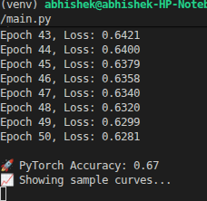

# 🪐 Exoplanet Detection using CNN

A Deep Learning project that detects exoplanets by analyzing stellar light curves.

---

## 🌌 Overview
When a planet passes in front of a star, it causes a small dip in brightness.  
This project uses a Convolutional Neural Network (CNN) to detect these dips.

---

## 🧠 Problem Statement
Detecting exoplanets manually from light curves is extremely difficult due to:
- Noise in data
- Small signal variations
- False positives

---

## 💡 Solution
This project applies Deep Learning (CNN) to identify patterns automatically  
in time-series data and detect possible exoplanet transits.

---

## ⚙️ How It Works
1. Generate synthetic light curve data
2. Add noise and variability
3. Train a CNN model on time-series signals
4. Detect transit patterns

---

## 📊 Results
- Accuracy: **67%**
- Handles noisy signals
- Successfully detects basic transit patterns

---

## SAMPLE LIGHT KURVE

 
 - THIS IS SIMULATED DATA 

---

## 📊 Light Curve Analysis

This graph shows sample stellar light curves used in the model.

- The **blue line (Planet)** represents a star with an orbiting exoplanet.
- The **orange line (No Planet)** represents a star without any planetary transit.

### 🔍 Key Observation:
- When a planet passes in front of a star, it causes a **slight dip in brightness** (called a transit).
- These dips are often very small and hidden within noise.
- The model learns to detect these subtle patterns.

### 🧠 Insight:
Even though both signals appear noisy and similar, the CNN is trained to identify  
hidden patterns that indicate the presence of an exoplanet.

This demonstrates the challenge of exoplanet detection and the importance of AI in analyzing time-series astronomical data.

---

## ⚠️ Important Note
This project uses **synthetic data** and serves as a proof-of-concept.  
Performance may vary on real astronomical datasets.

---

## 📈 Output

---

## 🧰 Tech Stack
- Python
- NumPy
- PyTorch
- Matplotlib

---

## 🧠 My Approach
- Focused on signal pattern recognition
- Simulated realistic noise conditions
- Used CNN for time-series classification

---

## ⚠️ Limitations
- Trained on synthetic data only
- Lower accuracy due to noise complexity
- Needs real-world dataset validation

---

## 🚀 Why This Project Matters
Exoplanet discovery is one of the most exciting areas in astronomy.  
Automating detection with AI can significantly accelerate discoveries.

---

## 🙋 About Me
A Class 12 student exploring the intersection of Astronomy and AI.

---

⭐ Star this repo if you found it interesting!
